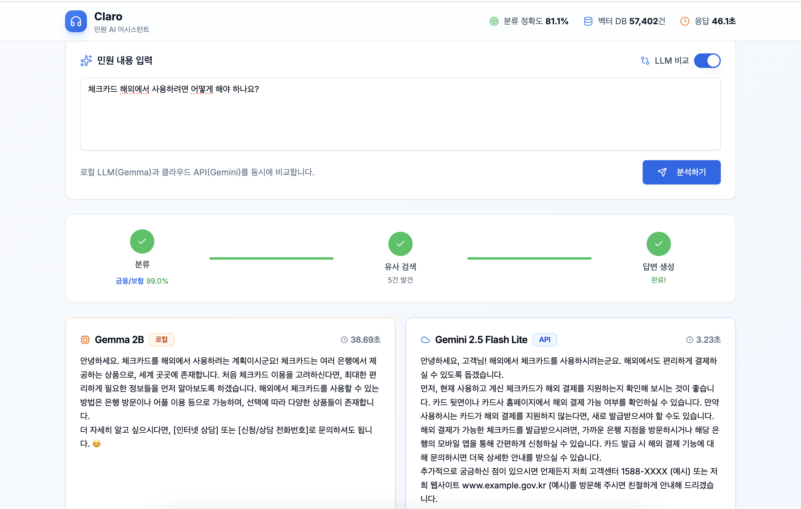

# 🏛️ Claro - 민원 AI 어시스턴트

> 공공기관 상담원을 위한 AI 업무 지원 시스템




## 📋 프로젝트 소개

**Claro**는 공공기관 콜센터 상담원들의 업무 효율성을 높이기 위한 AI 어시스턴트입니다.

하루 80콜 이상 처리하면서 2,000여 개 매뉴얼에서 정보를 찾느라 시간을 쓰는 상담원들을 위해, AI가 민원을 자동 분류하고, 유사 사례를 검색하며, 답변 초안을 생성합니다.

## ✨ 주요 기능

| 기능 | 설명 | 성능 |
|------|------|------|
| **민원 자동 분류** | 민원 내용 → 14개 도메인 자동 분류 | 81.1% 정확도 |
| **유사 민원 검색** | 과거 처리된 비슷한 민원과 답변 검색 | 57,402건 DB |
| **답변 초안 생성** | RAG 기반 매뉴얼 + 과거 사례로 답변 생성 | Gemma/Gemini |
| **LLM 비교** | 로컬 LLM vs 클라우드 API 동시 비교 | 속도/품질 비교 |

## 🏗️ 시스템 아키텍처

```
┌─────────────────────────────────────────────────────────────┐
│                      Frontend (Next.js)                      │
│                      localhost:3000                          │
└─────────────────────────┬───────────────────────────────────┘
                          │
          ┌───────────────┴───────────────┐
          ▼                               ▼
┌─────────────────────┐       ┌─────────────────────┐
│    ML Service       │       │    LLM Service      │
│    (FastAPI)        │       │    (FastAPI)        │
│    localhost:8001   │       │    localhost:8002   │
├─────────────────────┤       ├─────────────────────┤
│ • 민원 분류 (BERT)  │       │ • RAG Chain         │
│ • 14개 도메인       │       │ • FAISS 벡터 검색   │
│ • 81.1% 정확도      │       │ • Ollama (Gemma)    │
└─────────────────────┘       │ • Gemini API        │
                              └─────────────────────┘
                                        │
                              ┌─────────┴─────────┐
                              ▼                   ▼
                      ┌─────────────┐     ┌─────────────┐
                      │   Ollama    │     │ Gemini API  │
                      │ (로컬 LLM)  │     │ (클라우드)  │
                      │ gemma2:2b   │     │ 2.5 Flash   │
                      │ civil-qwen  │     │    Lite     │
                      └─────────────┘     └─────────────┘
```

## 🛠️ 기술 스택

### Backend
- **FastAPI** - ML/LLM 서비스 API
- **PyTorch** - 딥러닝 프레임워크
- **Transformers** - BERT 분류 모델
- **LangChain** - RAG 체인 구성
- **FAISS** - 벡터 유사도 검색
- **Sentence-Transformers** - 임베딩 모델

### Frontend
- **Next.js 14** - React 프레임워크
- **TypeScript** - 타입 안정성
- **Tailwind CSS** - 스타일링
- **shadcn/ui** - UI 컴포넌트

### LLM
- **Ollama** - 로컬 LLM 서버
- **Gemma 2B** - 로컬 추론
- **Qwen 2.5 7B** - 파인튜닝 모델 (LoRA)
- **Gemini API** - 클라우드 LLM

### DevOps
- **Docker** - 컨테이너화
- **Docker Compose** - 멀티 컨테이너 관리

## 📁 프로젝트 구조

```
CivilComplaint/
├── docker-compose.yml          # Docker 컨테이너 설정
├── README.md
│
├── ml-service/                 # ML 서비스 (분류)
│   ├── Dockerfile
│   ├── requirements.txt
│   └── app/
│       ├── main.py
│       ├── api/routes/
│       │   └── classify.py     # 분류 API
│       ├── models/
│       │   └── classifier.py   # BERT 분류기
│       └── core/config.py
│
├── llm-service/                # LLM 서비스 (RAG)
│   ├── Dockerfile
│   ├── requirements.txt
│   └── app/
│       ├── main.py
│       ├── api/routes/
│       │   ├── generate.py     # 답변 생성
│       │   ├── search.py       # 유사 검색
│       │   └── compare.py      # LLM 비교
│       ├── chains/
│       │   └── rag_chain.py    # RAG 체인
│       ├── vectorstore/
│       │   └── faiss_store.py  # FAISS 벡터DB
│       └── llm/
│           ├── ollama.py       # 로컬 LLM
│           └── gemini.py       # Gemini API
│
├── frontend/                   # Next.js 프론트엔드
│   ├── Dockerfile
│   ├── package.json
│   └── src/
│       ├── app/page.tsx        # 메인 페이지
│       ├── components/
│       │   ├── ProcessingSteps.tsx
│       │   ├── SimilarComplaints.tsx
│       │   ├── AnswerDraft.tsx
│       │   └── LLMCompare.tsx
│       └── lib/api.ts
│
├── notebooks/                  # ML 파이프라인
│   ├── 01_data_exploration.ipynb
│   ├── 02_preprocessing.ipynb
│   ├── 03_classification_model.ipynb
│   ├── 04_embedding_model.ipynb
│   ├── 05_rag_vectordb.ipynb
│   ├── 06_llm_finetuning_llamafactory.ipynb
│   └── 07_convert_gguf.ipynb
│
└── models/                     # 학습된 모델
    ├── domain_classifier/      # 분류 모델
    ├── embedding/              # 임베딩 모델
    └── llm_qwen/               # 파인튜닝 LLM
        ├── civil-lora.gguf
        └── Modelfile
```

## 🚀 실행 방법

### 사전 요구사항

- Docker & Docker Compose
- Ollama (로컬 LLM용)
- Google API Key (Gemini용)

### 1. 레포지토리 클론

```bash
git clone https://github.com/your-username/CivilComplaint.git
cd CivilComplaint
```

### 2. 환경 변수 설정

```bash
cp .env.example .env
# .env 파일에 GOOGLE_API_KEY 입력
```

### 3. 모델 다운로드

모델 파일은 용량이 커서 별도 다운로드가 필요합니다.

```bash
# 모델 다운로드 스크립트 (준비 예정)
./scripts/download_models.sh
```

또는 Google Drive에서 직접 다운로드:
- [모델 다운로드 링크] (추후 추가)

### 4. Ollama 설정

```bash
# Ollama 설치 후
ollama pull gemma2:2b

# 파인튜닝 모델 사용 시 (선택)
ollama pull qwen2.5:7b-instruct
cd models/llm_qwen
ollama create civil-qwen -f Modelfile
```

### 5. Docker로 실행

```bash
docker-compose up
```

### 6. 접속

브라우저에서 http://localhost:3000 접속

## 📊 성능 지표

| 지표 | 값 |
|------|-----|
| 분류 정확도 | 81.1% |
| 벡터 DB 문서 수 | 57,402건 |
| 도메인 수 | 14개 |
| Gemma 2B 응답 시간 | 25~35초 |
| Gemini API 응답 시간 | 1~3초 |

## 📚 데이터셋

AI Hub 공공 데이터 활용:

| 데이터셋 | 용도 |
|----------|------|
| 한국어 대화 (공공민원) | 분류 모델 학습 |
| 민원 콜센터 질의응답 | RAG 지식베이스 |
| 민간 민원 LLM 데이터 | LLM 파인튜닝 |

## 🔧 개발 환경 실행 (Docker 없이)

```bash
# 1. ML Service
cd ml-service
conda activate claro
uvicorn app.main:app --port 8001 --reload

# 2. LLM Service
cd llm-service
conda activate claro
uvicorn app.main:app --port 8002 --reload

# 3. Frontend
cd frontend
npm install
npm run dev

# 4. Ollama
ollama serve
```

## 📝 API 엔드포인트

### ML Service (8001)

| Method | Endpoint | 설명 |
|--------|----------|------|
| POST | `/api/v1/classify` | 민원 분류 |
| POST | `/api/v1/classify/batch` | 배치 분류 |
| GET | `/api/v1/classify/labels` | 레이블 목록 |

### LLM Service (8002)

| Method | Endpoint | 설명 |
|--------|----------|------|
| POST | `/generate/` | RAG 답변 생성 |
| POST | `/search/similar` | 유사 민원 검색 |
| POST | `/compare/` | LLM 비교 |

## 🗺️ 로드맵

- [x] 민원 자동 분류 (BERT)
- [x] 유사 민원 검색 (FAISS)
- [x] 답변 초안 생성 (RAG)
- [x] LLM 비교 기능
- [x] Docker 컨테이너화
- [x] LLM 파인튜닝 (Qwen + LoRA)
- [ ] Spring Security + OAuth2
- [ ] Redis 캐싱
- [ ] MLFlow 모델 버전 관리
- [ ] 실시간 상담 지원

## 📄 라이선스

이 프로젝트는 [MIT 라이선스](LICENSE) 하에 배포됩니다.

## 👤 만든 사람

- **쿠카** - [GitHub](https://github.com/your-username)

---

⭐ 이 프로젝트가 도움이 되었다면 Star를 눌러주세요!
